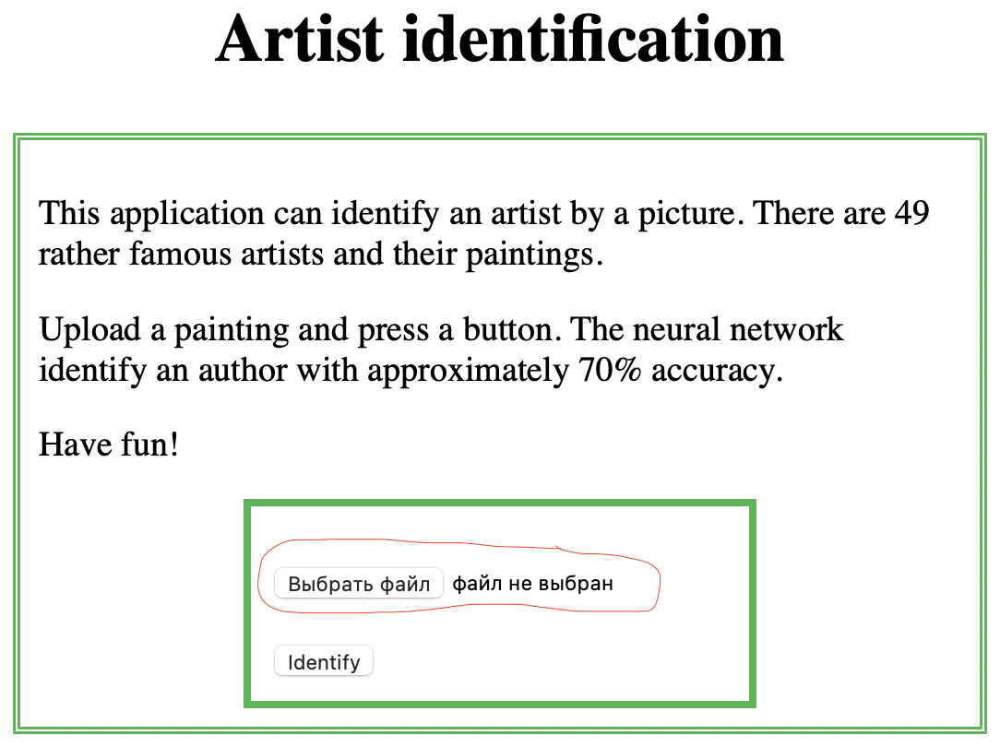
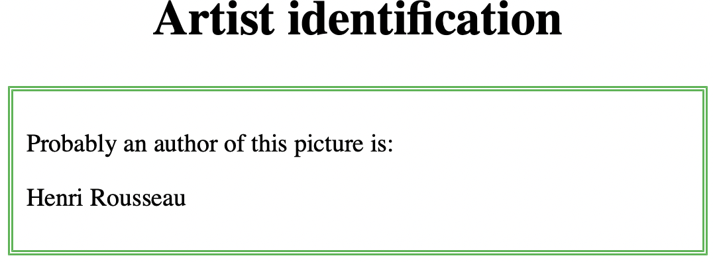

# Artists identification - LSML2 Final project
This project is devoted to artist identification from a painting.

### Dataset
There are 49 famous artists from all over the world. It was taken from https://www.kaggle.com/ikarus777/best-artworks-of-all-time. Dataset was divided by train, val and test sets using script `create_dataest.py`. 

### Model
I used pretrained ResNet, Adam optimizer. There were two expirements with it:
1) The last layer was changed for linear with 49 classes and model was trained for picture dataset from kaggle. Classes slightly inbalance therefore `weighted accuracy` was used. Loss function was `CrossEntropyLoss`. The accuracy is 0.71.
2) The last layer was changed to `nn.Sequential(nn.Linear(2048, num_ftrs), nn.ReLU(), nn.Dropout(0.2), nn.Linear(num_ftrs, num_classes), nn.LogSoftmax(dim=1))`. Loss function was `NLLLoss`. The accuracy is 0.66 (you can see this model in Notebook). 

Also there were several expirements with different transformations but it didn't improve the quality of the model.

In current application the simpliest model with linear the last layer is used. 

## How to launch an app

## How to work with app
Select one painting from test folder and upload it. Then press button "identify". On the next page the name of artist will appear. Also you can find any picture in web. Pictures from test folder weren't involve in model training.

<table>
<tr>
  <td></td>
  <td></td>
</tr>
</table>

**Attention:** on Mac with M1 this application can work unstable (*[W NNPACK.cpp:79] Could not initialize NNPACK! Reason: Unsupported hardware.*)
